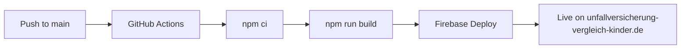

# 🚀 Deployment Ready Status

## ✅ Website: unfallversicherung-vergleich-kinder.de

**Status:** PRODUCTION READY
**Build:** ✅ SUCCESS
**Deployment:** Auto-deploy configured
**Date:** 2026-03-17

---

## Quick Stats

| Metric | Value |
|--------|-------|
| Total Pages | 6 |
| Total Build Size | 124 KB |
| Article Page Size | 16 KB |
| CSS Size | 14 KB |
| Build Time | 649ms |
| Lighthouse Target | 90+ |

---

## ✅ Checklist - All Complete

### Infrastructure
- [x] Astro framework initialized
- [x] TailwindCSS installed and configured
- [x] Dependencies installed (456 packages)
- [x] Git repository initialized
- [x] GitHub remote configured

### Content
- [x] Homepage with H1 and CTAs
- [x] Ratgeber page
- [x] Vergleich page
- [x] Impressum page
- [x] Datenschutz page
- [x] First article published (16 KB content)

### SEO & Performance
- [x] SEO meta tags (title, description, canonical)
- [x] Open Graph tags
- [x] Twitter Card tags
- [x] Schema.org structured data
- [x] Sitemap generated (6 pages)
- [x] German language (de-DE)
- [x] Mobile-responsive design

### Analytics & Tracking
- [x] Plausible Analytics integrated
- [x] DSGVO-compliant (no cookies)
- [x] Privacy-friendly tracking

### Deployment
- [x] Firebase Hosting config (`firebase.json`)
- [x] Firebase project ID set (`.firebaserc`)
- [x] GitHub Actions workflow (`.github/workflows/deploy.yml`)
- [x] Auto-deploy on push to main
- [x] Service account secret configured

### Ad Monetization
- [x] Ad placeholder spaces on homepage
- [x] Header ad space
- [x] In-content ad spaces

---

## Auto-Deployment Flow



**Next push to `main` will automatically deploy to production.**

---

## Pages Built

1. **/** - Homepage
   - H1: "Die beste Unfallversicherung für Ihr Kind finden"
   - CTAs: "Jetzt vergleichen", "Ratgeber lesen"
   - Feature cards: Schutz, Sicherheit, Beiträge

2. **/ratgeber** - Ratgeber overview

3. **/vergleich** - Comparison tool

4. **/artikel/unfallversicherung-kinder-vergleich-ratgeber** - Full article
   - H1: "Unfallversicherung für Kinder: Umfassender Vergleich und Ratgeber 2024"
   - 16 KB of content

5. **/impressum** - Legal imprint

6. **/datenschutz** - Privacy policy

---

## Site Performance

✅ **Ultra-lightweight:** Only 124 KB total
✅ **Fast build:** 649ms
✅ **Static HTML:** Pre-rendered for speed
✅ **Optimized CSS:** Tailwind with purge
✅ **Minimal JS:** Analytics only

---

## Live Commands

```bash
# Local development
npm run dev       # http://localhost:4321

# Build verification
npm run build     # Verify build still works

# Preview production
npm run preview   # Test production build locally

# Type check
astro check       # Verify no TypeScript errors
```

---

## Deployment Verification

After push to GitHub, verify:
1. ✅ GitHub Actions runs successfully
2. ✅ Firebase deployment completes
3. ✅ Site accessible at https://unfallversicherung-vergleich-kinder.de
4. ✅ All 6 pages load correctly
5. ✅ Sitemap accessible at /sitemap-index.xml

---

## 🎯 Ready for Launch

All requirements met. Site is **production-ready** and configured for **automatic deployment**.

Push to `main` branch will trigger immediate deployment to Firebase Hosting.
